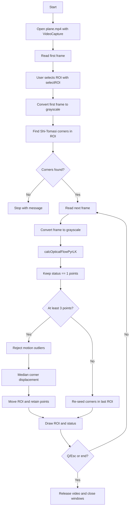

# Module 3 — Sparse optical flow

The runnable lesson lives in the self-contained `module_3_sparse_optical_flow/`
project at the repository root. It lets you select an object in the first frame, seeds Shi–Tomasi
corners, and tracks them with pyramidal Lucas–Kanade flow.

```bash
uv sync
uv run python module_3_sparse_optical_flow/track_object.py
```

This is the minimal starting point. Robust estimation, ORB recovery, and
Kalman filtering are planned follow-up modules.

Begin with [Lab 1 — Select and track one object](lab-1-select-and-track.md)
before changing the tracker.

## What the demo does

The video shows a plane moving across the sky. On the first frame, drag a
rectangle around the plane and press **Enter**. The script finds trackable
corners inside that rectangle, follows those corners in each new frame, and
moves the rectangle by the median corner displacement.


*Choose the plane in this initial frame.*


*The blue rectangle is the tracked ROI. The same object is larger and higher
later in the clip; the ROI is updated from the motion of its corners.*

## Algorithms and OpenCV calls used

| Purpose | OpenCV API | Algorithm or operation |
| --- | --- | --- |
| Read frames | `cv2.VideoCapture` | Video decoding and sequential frame access |
| Select the object | `cv2.selectROI` | Interactive rectangle selection utility |
| Prepare optical-flow input | `cv2.cvtColor` | BGR-to-grayscale colour conversion |
| Find trackable points | `cv2.goodFeaturesToTrack` | Shi–Tomasi good-corner detection |
| Track points | `cv2.calcOpticalFlowPyrLK` | Pyramidal Lucas–Kanade sparse optical flow |
| Show the result | `cv2.rectangle`, `cv2.putText`, `cv2.imshow` | ROI and status visualization |
| Control playback | `cv2.waitKey` | Keyboard input and frame timing |

The median-motion calculation and outlier threshold are implemented with
NumPy; they are not additional OpenCV algorithms. The current lesson does not
yet use RANSAC, affine transforms, homographies, ORB, BFMatcher, or a Kalman
filter.

## Code flow



The corresponding code stages are:

1. `VideoCapture` opens the bundled video and reads its first frame.
2. `selectROI` pauses for the user to draw the object rectangle.
3. `feature_points` masks that rectangle and calls
   `goodFeaturesToTrack` to seed points.
4. Each loop iteration converts the new frame to grayscale and calls
   `calcOpticalFlowPyrLK` with the previous grayscale frame and points.
5. Valid point pairs are filtered, their median displacement moves the ROI,
   and the surviving points become the input for the next iteration.
6. If too few points survive, the script searches for new corners inside the
   last known ROI. Playback ends on **Q**, **Esc**, or end-of-file.
