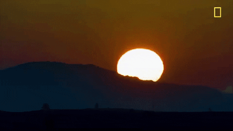
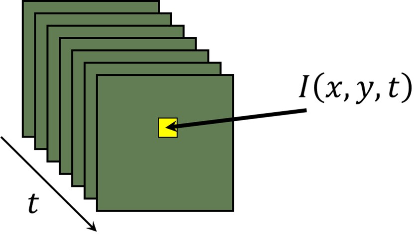
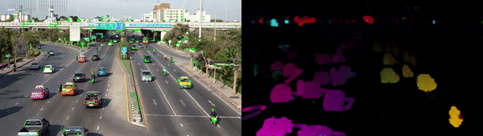
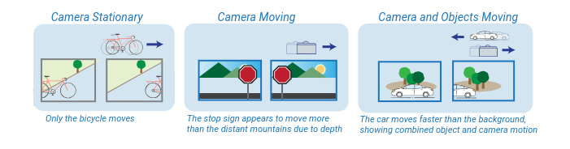

# Module 3 — Sparse optical flow

Optical flow is a concept in computer vision that refers to the pattern of apparent motion of objects, surfaces, and edges in a visual scene, caused by the relative motion between the observer (camera) and the scene. In simpler terms, it’s the perceived motion of pixels across frames in a video or sequence of images.

**Key Concepts of Optical Flow**:

- **Pixel Displacement**:
    Optical flow describes how individual pixels move from one frame to the next. For each pixel, it estimates a motion vector that shows the direction and magnitude of movement.
- **Motion Vectors**:
    Each pixel or feature in the frame is assigned a motion vector, which is essentially a 2D vector indicating where the pixel has moved. This is represented by a horizontal and vertical displacement (e.g., (u,v)(u, v)(u,v)), providing both direction and speed of motion.
- **Assumptions**:
    Optical flow computation typically relies on certain assumptions, like brightness constancy (the intensity of a pixel remains constant across frames) and temporal coherence (the motion is continuous over time). These assumptions simplify the process of estimating motion but can limit optical flow’s accuracy under extreme changes in lighting or rapid movements.

---

## Further theory: motion and optical flow

The following beginner-friendly notes summarize sections 1 and 2 of
[DataHacker's Lucas–Kanade optical-flow tutorial](https://datahacker.rs/calculating-sparse-optical-flow-using-lucas-kanade-method/).

### 1. Understanding motion in video

A video is a fast sequence of still images called **frames**. Motion is the
change we see when we compare one frame with the next one: a bird changes
place, a car moves, or the camera itself turns. For a computer, a pixel is not
only at a position `(x, y)`; in video it also has a time, `t`. In short, the
computer asks: “What changed at this place from this moment to the next?”

*Images: © Master Data Science / DataHacker. Local copies from the original
[tutorial](https://datahacker.rs/calculating-sparse-optical-flow-using-lucas-kanade-method/);
all rights remain with the copyright holder.*

### 2. Optical flow and its types

**Optical flow** is the collection of little arrows that describe apparent
pixel movement between two nearby frames. An arrow tells us a direction and an
amount of movement. The movement may come from an object, such as the plane,
or from the camera moving.

There are two common choices:

- **Sparse optical flow** follows only selected, distinctive points, such as
  corners. It is fast and is the method used in this module.
- **Dense optical flow** estimates an arrow for almost every pixel. It gives a
  fuller motion picture, but needs more computation.

*Image: © Master Data Science / DataHacker. Local copy from the original
[tutorial](https://datahacker.rs/calculating-sparse-optical-flow-using-lucas-kanade-method/);
all rights remain with the copyright holder.*

---

While optical flow captures apparent motion in an image sequence, the observed motion can arise from different sources. In particular, motion in a video can be caused by:
- moving objects,
- camera motion,
- or a combination of both.

Understanding this distinction is key to interpreting optical flow results and choosing an appropriate estimation algorithm. Optical flow does not directly distinguish between object motion and camera motion. Instead, it reflects the relative motion between the scene and the camera. Objects that are closer to the camera have greater apparent motion in a series of images than objects that are further away. Except for scenarios in which both the camera and the objects closer to it are stationary, objects that are closer to the camera have greater apparent motion in a series of images than objects that are further away. These scenarios illustrate how different combinations of camera and scene motion affect the observed optical flow in consecutive frames:

- Camera is stationary and an object close to the camera is moving — The object appear to move past the camera. For example, a bicycle passing in front of a camera while objects in the background remain stationary.

- Camera is moving and objects are stationary — Objects close to the camera appears to move more than distant objects. For example, a stop sign close to a moving camera appears to move past the camera faster than a mountain in the distance.

- Camera is moving and an object close to the camera is moving — The object close to the camera appears to move fast, while objects further from the camera appear to move more slowly. For example, if a camera is moving in one direction and a car in the foreground is moving in the opposite direction, the car appears to move much faster than stationary trees beyond the car.

---

## Demo: before we start

Run [Demo](sparse-optical-flow.md). It uses the bundled plane video, Shi–Tomasi corners, and Lucas–Kanade flow to move a selected rectangle.

---

## Mini-project roadmap

| Milestone | Status | Goal |
| --- | --- | --- |
| [Lab 1 — Select and track one object](lab-1-select-and-track.md) | Available | Track a user-selected plane from its Shi–Tomasi corners. |
| Camera motion estimation | Planned | Summarize consistent background-point motion as pan, tilt, or shake. |
| Video stabilization | Planned | Use estimated camera movement to define a steadier view. |
| Motion-based activity detection | Planned | Decide whether a scene contains meaningful movement from tracked points. |
| Sports and human-motion analysis | Planned | Summarize local motion around a player, tool, or body joint. |
| Visual-odometry preview | Planned | Use feature tracks as the starting point for camera-displacement estimation. |

The planned projects are roadmap entries, not runnable labs yet. Video
stabilization and visual odometry will build on robust estimation from Module
4.
