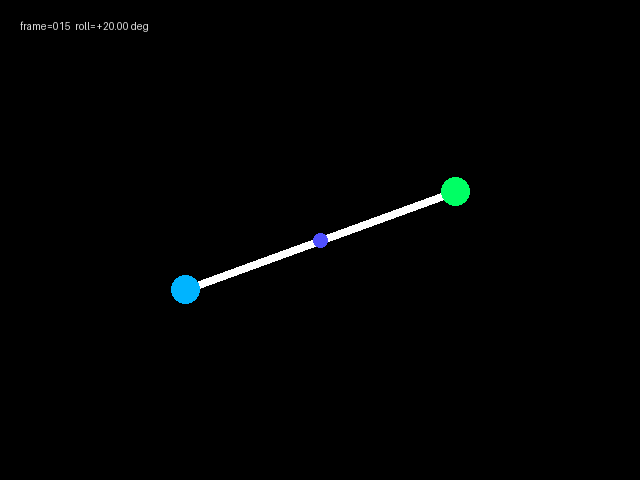
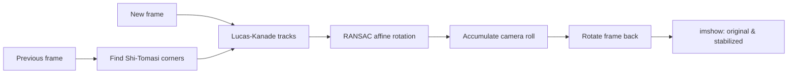

# Lab 3.1 — Stabilize with optical flow and RANSAC

Lab 3 used the IMU to learn camera roll. This lab uses only the images. It
tracks corners between frames, asks RANSAC which tracks agree on the camera
motion, then rotates the image back toward the first level frame.

## The idea

Every frame contains a few strong corners: the coloured dots, bar ends, and
text edges. Lucas–Kanade optical flow follows those corners from the old frame
to the new frame. Some tracks can be wrong, so RANSAC finds the rotation that
the largest agreeing group of tracks supports.

No IMU data is read. The first frame is treated as level, so this method can
remove rotation relative to the beginning of the sequence. It cannot know the
real-world horizon if the first frame is already tilted.

---

## The dataset

This lab uses the same `code/stabilize/roll_imu_dataset/frames/` images as Lab
3. It reads `camera.csv` only to get the ordered filenames. `imu.csv` and
`roll_rad` are deliberately unused.



---

## Flow to correct the image



`calcOpticalFlowPyrLK` gives candidate corner movements. `estimateAffinePartial2D`
with `RANSAC` rejects movements that do not match the main camera rotation.
The resulting affine transform contains rotation, translation, and scale; this
lab uses its rotation component.

The synthetic frame counter in the top strip does not rotate with the bar. The
solution masks that strip before detecting corners, so RANSAC estimates the
motion of the rotating scene instead of the fixed overlay.

---

## Run the solution

From the project root:

```bash
uv run python docs/module-3/code/stabilize/stabilize_with_optical_flow.py
```

The program opens an OpenCV movie-style window: **Original** is on the left
and **Stabilized** is on the right. Yellow lines and red dots on the original
side show the RANSAC-approved feature tracks. Press **Q** or **Esc** to stop.
It writes no video file.

---

## Read the key lines

```python
next_points, status, _ = cv2.calcOpticalFlowPyrLK(old, new, points, None)
transform, _ = cv2.estimateAffinePartial2D(good_old, good_new, method=cv2.RANSAC)
image_turn = math.atan2(transform[1, 0], transform[0, 0])
```

The final angle is added to the estimated camera path. OpenCV then applies the
opposite angle with `getRotationMatrix2D` and `warpAffine`.

---

## What can fail?

- Too few corners: optical flow has nothing reliable to follow.
- Lots of independently moving objects: they can outnumber background tracks.
- Motion blur or large jumps: matching corners becomes difficult.
- A tilted first frame: the sequence becomes stable relative to that tilt, not
  to the real horizon.

This is why IMU fusion is useful later: it can supply rotation information when
the image tracks are weak.
