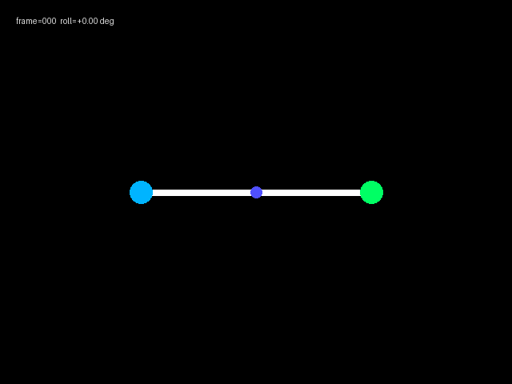
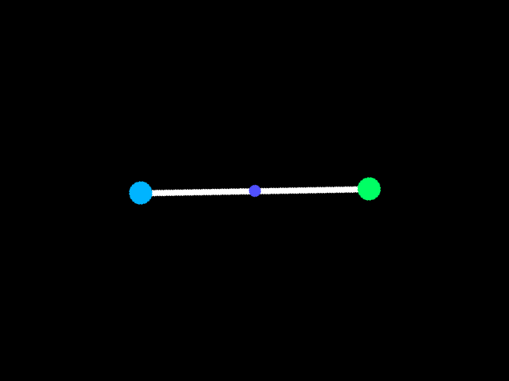
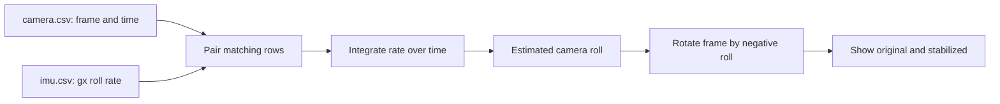

# Lab 3 — Stabilize roll with IMU

In this lab, the camera rolls left and right, making a level bar look tilted.
You will use the gyroscope data to estimate that roll and rotate every frame
back to level. This first version uses the IMU only. The later reference adds
sparse optical flow as a second estimate.

## The idea

The gyroscope reports how quickly the camera is rotating: `gx_rad_s` means
**radians per second around the roll axis**. A small rotation rate over a small
time adds a small angle:

```text
roll angle = previous roll angle + rotation rate × elapsed time
```

Once you know the roll angle, OpenCV can rotate the picture by the opposite
angle. The bar is not moving in the world; the camera is rotating, so undoing
the camera rotation makes the bar level again.

---

## The dataset

The dataset is in `code/stabilize/roll_imu_dataset/`:

- `camera.csv` lists the timestamp and filename for every camera frame. It also
  contains `roll_rad`, but treat that column as a teacher-only answer: do not
  use it in your tracker.
- `imu.csv` contains the matching timestamp and `gx_rad_s`, the roll rate you
  will integrate.
- `frames/` contains 150 PNG images at 30 frames per second.

The first image is level. Around frame 15, the virtual camera has rolled by
about 20 degrees, so the white bar looks diagonal. The third image shows the
target result after applying the IMU correction.






---

## Stabilization flow



`camera.csv` tells the program which frame belongs to each timestamp.
`imu.csv` tells it how quickly the camera is rolling at that same time. The
negative sign matters: if the camera rotates clockwise, rotate the image
counter-clockwise to correct it.

---

## Start with the starter

From the project root:

```bash
uv run python docs/module-3/code/stabilize/lab_3_imu_stabilization.py
```

The starter reads both CSV files, checks that timestamps match, and displays
the original frames. Press **Q** or **Esc** to stop.

---

## Build the IMU stabilizer

### Step 1 — Keep the previous timestamp and roll

Before the frame loop, start at zero roll. The first frame is level in this
dataset.

```python
previous_time = None
roll = 0.0
```

### Step 2 — Integrate the gyro rate

Change the loop to receive `timestamp` and `gx_rad_s`. For every frame after
the first one, calculate seconds between samples, then add the rate times that
time. This is called integration.

```python
if previous_time is not None:
    dt = (timestamp - previous_time) / 1_000_000_000
    roll += gx_rad_s * dt
previous_time = timestamp
```

**Try it:** print `math.degrees(roll)`. Near frame 15 it should be close to
20 degrees.

### Step 3 — Rotate the frame back

Get the image centre and make an OpenCV rotation matrix. Use **negative** roll:
the correction must undo the camera tilt.

```python
height, width = frame.shape[:2]
matrix = cv2.getRotationMatrix2D((width / 2, height / 2), -math.degrees(roll), 1.0)
stabilized = cv2.warpAffine(frame, matrix, (width, height), borderMode=cv2.BORDER_REPLICATE)
```

### Step 4 — Show both frames

Put the original frame on the left and the corrected frame on the right. This
is the fastest way to see whether your sign is correct.

```python
comparison = cv2.hconcat([frame, stabilized])
cv2.imshow("Lab 3 — IMU stabilization", comparison)
```

If the corrected bar becomes *more* tilted, reverse the sign once. Do not add
extra filters to hide a sign mistake.

---

## Where optical flow fits later

The IMU measures camera rotation even when an image is blurry or dark. Sparse
optical flow measures how corners in the image move. A later implementation
will estimate rotation from tracked corners, then blend that estimate with the
IMU roll. See the completed
[`stabilize_with_fusion.py`](code/stabilize/stabilize_with_fusion.py) only
after finishing this IMU-only lab.

---

## Quick quiz

<form class="quiz" data-answer="b" data-explanation="The gyro gives a rotation rate, so multiplying by elapsed time adds an angle.">
  <fieldset>
    <legend>1. What does the lab integrate?</legend>
    <label><input type="radio" name="lab3-q1" value="a"> The frame width</label><br>
    <label><input type="radio" name="lab3-q1" value="b"> Gyro roll rate over time</label><br>
    <label><input type="radio" name="lab3-q1" value="c"> The answer column in camera.csv</label>
  </fieldset>
  <button type="button" class="quiz-check">Check answer</button>
  <p class="quiz-result" aria-live="polite"></p>
</form>

<form class="quiz" data-answer="a" data-explanation="The image must rotate opposite to the measured camera roll to undo the tilt.">
  <fieldset>
    <legend>2. Why does the rotation use negative roll?</legend>
    <label><input type="radio" name="lab3-q2" value="a"> It undoes the camera tilt</label><br>
    <label><input type="radio" name="lab3-q2" value="b"> It makes the gyro faster</label><br>
    <label><input type="radio" name="lab3-q2" value="c"> It removes all image corners</label>
  </fieldset>
  <button type="button" class="quiz-check">Check answer</button>
  <p class="quiz-result" aria-live="polite"></p>
</form>

<form class="quiz" data-answer="c" data-explanation="roll_rad is ground truth for checking the exercise, not an input to the stabilizer.">
  <fieldset>
    <legend>3. Why not use camera.csv's roll_rad column?</legend>
    <label><input type="radio" name="lab3-q3" value="a"> It contains frame filenames</label><br>
    <label><input type="radio" name="lab3-q3" value="b"> OpenCV cannot read CSV files</label><br>
    <label><input type="radio" name="lab3-q3" value="c"> It would give away the answer</label>
  </fieldset>
  <button type="button" class="quiz-check">Check answer</button>
  <p class="quiz-result" aria-live="polite"></p>
</form>

---

## Completion checklist

- [ ] I can explain why a camera roll makes a level object look tilted.
- [ ] I used matching camera and IMU timestamps.
- [ ] I integrated `gx_rad_s` without reading `roll_rad`.
- [ ] I can see the original and stabilized frames side by side.
