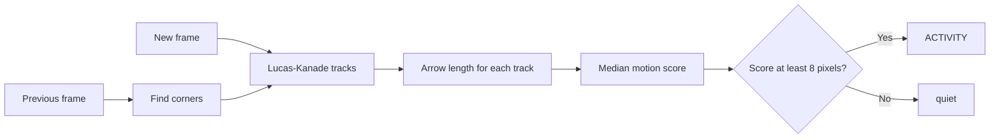

# Lab 4 — Motion-based activity detection

Activity detection asks a simple question: **are important image points moving
enough to call this frame active?** It does not identify a plane, person, or
car. It measures motion and turns that measurement into an easy label:
**quiet** or **ACTIVITY**.

## The idea

Sparse optical flow gives an arrow for every tracked corner. The arrow length
is how far that corner moved between two frames. This lab takes the **median**
arrow length as one activity score for the whole frame.



The median is a useful simple choice because one bad corner should not make a
quiet frame look active.

---

## The dataset

This lab uses `code/lab-1/plane.mp4`, the same moving-plane video used in Lab
1. The plane moves against a mostly static sky, so its corners produce longer
arrows than a quiet background.


The threshold is **8 pixels per frame** for this specific video. A threshold
is not magic: a faster video, a higher-resolution camera, or a different frame
rate needs a different value.

---

## Run the solution

From the project root:

```bash
uv run python docs/module-3/code/lab-4/activity_detection.py
```

The OpenCV window shows yellow motion arrows and red tracked corners. The
top-left label shows the median motion score and either **ACTIVITY** or
**quiet**. Press **Q** or **Esc** to stop.

---

## Read the core calculation

```python
distance = np.linalg.norm(new - old, axis=1)
score = float(np.median(distance))
active = score >= ACTIVITY_THRESHOLD
```

`new - old` creates the optical-flow arrows. `np.linalg.norm` changes each
two-number arrow into one length. The comparison with the threshold makes the
final activity decision.

### Linear algebra refresher

One tracked corner is a 2D position vector. If a corner was at `(100, 50)` in
the old frame and `(106, 47)` in the new frame, the two vectors are:

```text
old = [100, 50]
new = [106, 47]
motion = new - old = [6, -3]
```

`[6, -3]` means six pixels right and three pixels up. It has direction, so it
is a **vector**. Activity needs one number instead, so the code uses the
Euclidean, or L2, norm:

```text
length = ||motion||₂ = √(6² + (-3)²) = √45 ≈ 6.7 pixels
```

The norm is also the square root of a vector dotted with itself:

```text
||motion||₂ = √(motion · motion)
```

That is why a diagonal movement is longer than either its horizontal or
vertical part alone.

### What NumPy receives

`old` and `new` are matrices with one row per successful track and two columns:
`x` and `y`. For three tracks, subtraction happens row by row:

```text
new - old = [[ 6, -3],
             [ 1,  2],
             [10,  0]]
```

`axis=1` tells NumPy: “take one norm across each row.” The result is one
distance per track:

```text
[6.7, 2.2, 10.0]
```

Finally, `np.median` sorts those lengths and selects the middle one. Here the
activity score is `6.7` pixels. With the lab threshold of `8.0`, this frame is
quiet. A mean would be pulled higher by the 10-pixel track; the median is more
resistant to that one unusual measurement.

---

## Important limitation

This is **motion detection**, not guaranteed object activity detection. If the
camera shakes or pans, many background corners move and the score can say
ACTIVITY even when the scene is still. Lab 3.1 shows how to estimate global
camera motion with optical flow and RANSAC; a stronger detector subtracts that
global motion before scoring the remaining tracks.

---

## Quick quiz

<form class="quiz" data-answer="b" data-explanation="The score is the median length of the successful optical-flow tracks.">
  <fieldset>
    <legend>1. What is the activity score in this lab?</legend>
    <label><input type="radio" name="lab4-q1" value="a"> The number of video frames</label><br>
    <label><input type="radio" name="lab4-q1" value="b"> The median track movement</label><br>
    <label><input type="radio" name="lab4-q1" value="c"> The plane's class name</label>
  </fieldset>
  <button type="button" class="quiz-check">Check answer</button>
  <p class="quiz-result" aria-live="polite"></p>
</form>

<form class="quiz" data-answer="c" data-explanation="Camera motion moves background corners too, so it can look like activity.">
  <fieldset>
    <legend>2. Why can camera shake cause a false activity label?</legend>
    <label><input type="radio" name="lab4-q2" value="a"> It removes all pixels</label><br>
    <label><input type="radio" name="lab4-q2" value="b"> It stops Lucas–Kanade from running</label><br>
    <label><input type="radio" name="lab4-q2" value="c"> It moves many background corners</label>
  </fieldset>
  <button type="button" class="quiz-check">Check answer</button>
  <p class="quiz-result" aria-live="polite"></p>
</form>

---

## Hands-on challenge — make activity meaningful

The current program labels every frame separately. Improve it so it reports an
event only when activity **starts**, for example `activity_started`, rather
than printing the same event on every active frame. Later, report one
`activity_ended` event when the scene becomes quiet again.

Do not use the solution code below; decide the state and data you need first.

### Challenge 1 — Remember the previous state

Keep whether the previous frame was quiet or active. Decide exactly when each
of these transitions should publish an event:

```text
quiet → ACTIVITY   activity_started
ACTIVITY → quiet   activity_ended
ACTIVITY → ACTIVITY no new event
quiet → quiet      no new event
```

Run the video and check that one moving period does not create dozens of
`activity_started` messages.

### Challenge 2 — Keep a short motion history

A single noisy frame can cross the threshold by accident. Keep the most recent
5–10 activity scores in a short history. Use that history to decide whether
motion has lasted long enough to count as real activity.

Questions to answer before coding:

- Should activity start when *most* recent scores exceed the threshold, or only
  when *all* do?
- Should activity end immediately after one quiet score?
- What delay feels reasonable for this 30 FPS video?

### Challenge 3 — Inspect vector direction

The current score keeps only vector lengths. Also record the median `dx` and
`dy` values from the tracked points. Compare a period where most vectors point
in one direction with a period where directions disagree.

Use your observation to explain whether the motion is likely one moving object,
camera movement, or noisy tracks. This is an investigation, not a requirement
to build a classifier.

---

## Completion checklist

- [ ] I can explain what one optical-flow arrow means.
- [ ] I can identify the score and threshold in the code.
- [ ] I know why a different video needs a different threshold.
- [ ] I can explain one way camera movement creates a false positive.
- [ ] I can describe when an activity-start event should be published.
