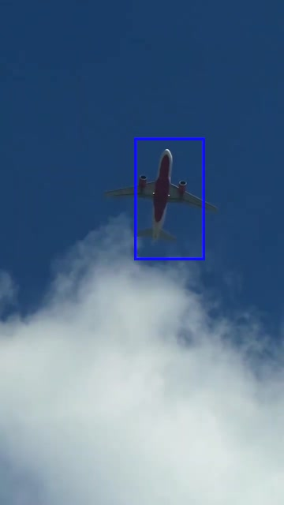
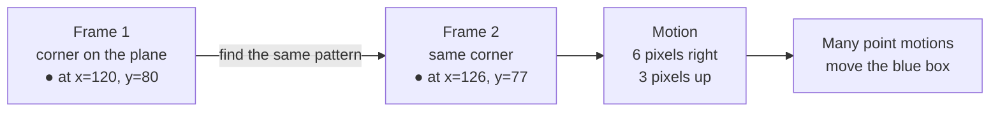
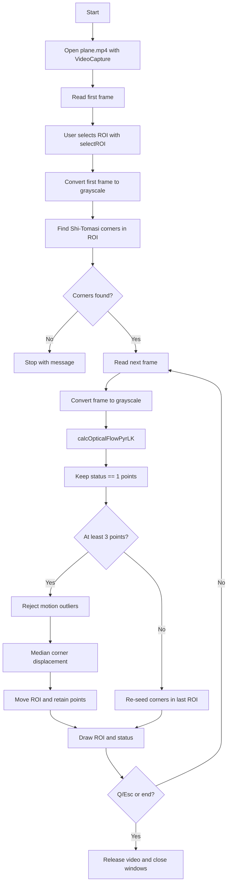

# Module 3 — Sparse optical flow

This is the concept lesson for Module 3. Read it before starting
[Lab 1 — Select and track one object](lab-1-select-and-track.md). It explains
the completed reference demo; the lab has you build the same core tracker in
small steps.

The runnable code lives in `code/example/track_object.py`. It lets you select
an object in the first frame, seeds Shi–Tomasi corners, and tracks them with
pyramidal Lucas–Kanade flow.

```bash
uv sync
uv run python docs/module-3/code/example/track_object.py
```

This is the minimal starting point. Robust estimation, ORB recovery, and
Kalman filtering are planned follow-up modules.

Begin with [Lab 1 — Select and track one object](lab-1-select-and-track.md)
before changing the tracker.

## What the demo does

The video shows a plane moving across the sky. On the first frame, drag a
rectangle around the plane and press **Enter**. The script finds trackable
corners inside that rectangle, follows those corners in each new frame, and
moves the rectangle by the median corner displacement.


*Choose the plane in this initial frame.*



*The blue rectangle is the tracked ROI. The same object is larger and higher
later in the clip; the ROI is updated from the motion of its corners.*

---

## The big idea

Imagine two photos taken a tiny moment apart. Instead of trying to understand
every pixel, sparse optical flow chooses a few **easy-to-recognize points** —
usually corners — and asks: *where did each point go in the next photo?*

It is like putting small stickers on the sharp corners of the plane, then
looking for the same stickers one frame later. The stickers are not real; the
program uses the light-and-dark pattern around each corner as its clue.



The arrow is called a **motion vector**. In this example, the point moved six
pixels right and three pixels up. If most good points on the plane have nearly
the same arrow, the program can move the whole blue rectangle by the typical
arrow.

---

## Why only a few points?

**Sparse** means *a small number*. The tracker does not calculate motion for
every pixel in the image. It follows perhaps 20–200 useful points instead.
That is faster and often enough to follow one object.

A plain patch of blue sky is a poor point: it looks almost the same everywhere,
so the program cannot tell which exact sky pixel it found. A corner, such as a
dark plane edge meeting a bright sky, has a more unique pattern. That is why
the demo starts with Shi–Tomasi corner detection.

Dense optical flow is the other idea: calculate an arrow for nearly every
pixel. It can show more detail, but it takes more work and is introduced later
in Module 7.

---

## How Lucas–Kanade finds a point

For every chosen corner, Lucas–Kanade looks at a small square around it in the
old frame. In the new frame, it searches nearby for the square that looks most
similar.

It works best when:

- frames are close together, so the point does not jump very far;
- the point has texture or a corner, not a flat colour;
- the point is still visible and has not been hidden or blurred.

The program does **not** know what a plane is. It only knows that a little
image pattern seems to have moved. If it accidentally follows a cloud or loses
the plane behind something, its answer can be wrong.

---

## Why use an image pyramid?

Fast motion is hard to find in a full-size image because the correct location
may be far away. A pyramid makes smaller, blurrier copies of each frame. At a
small size, a large movement becomes a smaller, easier movement. The tracker
first estimates movement in the small image, then improves that estimate at
larger sizes.

That is what the **pyramidal** part of `calcOpticalFlowPyrLK` means. It helps
with bigger movements, but it cannot fix every problem: a point that disappears
or changes appearance too much can still be lost.

---

## When a track is trustworthy

OpenCV returns a status value for each point. `status == 1` means it found a
possible new location; it is not a promise that the match is perfect. The demo
also compares point movements and ignores points that disagree strongly with
the group. It then uses the **median** movement, because one confused point
should not pull the rectangle far away.

When too few points remain, the tracker finds new corners inside its last
known rectangle. This is called **re-seeding**. It is a simple recovery method,
not object recognition: if the rectangle is already wrong, new corners can
also be wrong.

---

## Algorithms and OpenCV calls used

| Purpose | OpenCV API | Algorithm or operation |
| --- | --- | --- |
| Read frames | `cv2.VideoCapture` | Video decoding and sequential frame access |
| Select the object | `cv2.selectROI` | Interactive rectangle selection utility |
| Prepare optical-flow input | `cv2.cvtColor` | BGR-to-grayscale colour conversion |
| Find trackable points | `cv2.goodFeaturesToTrack` | Shi–Tomasi good-corner detection |
| Track points | `cv2.calcOpticalFlowPyrLK` | Pyramidal Lucas–Kanade sparse optical flow |
| Show the result | `cv2.rectangle`, `cv2.putText`, `cv2.imshow` | ROI and status visualization |
| Control playback | `cv2.waitKey` | Keyboard input and frame timing |

The median-motion calculation and outlier threshold are implemented with
NumPy; they are not additional OpenCV algorithms. The current lesson does not
yet use RANSAC, affine transforms, homographies, ORB, BFMatcher, or a Kalman
filter.

---

## Code flow



The corresponding code stages are:

1. `VideoCapture` opens the bundled video and reads its first frame.
2. `selectROI` pauses for the user to draw the object rectangle.
3. `feature_points` masks that rectangle and calls
   `goodFeaturesToTrack` to seed points.
4. Each loop iteration converts the new frame to grayscale and calls
   `calcOpticalFlowPyrLK` with the previous grayscale frame and points.
5. Valid point pairs are filtered, their median displacement moves the ROI,
   and the surviving points become the input for the next iteration.
6. If too few points survive, the script searches for new corners inside the
   last known ROI. Playback ends on **Q**, **Esc**, or end-of-file.
